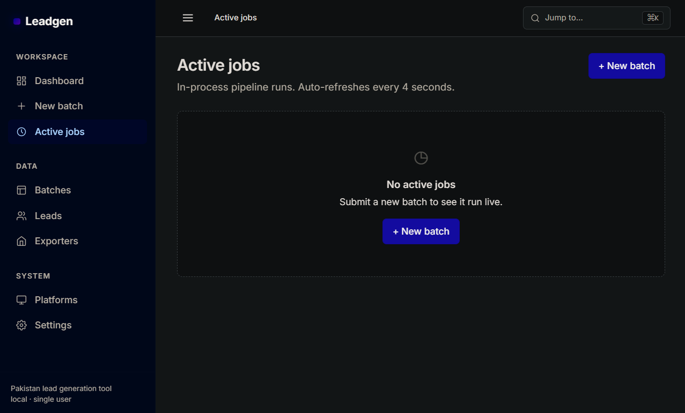
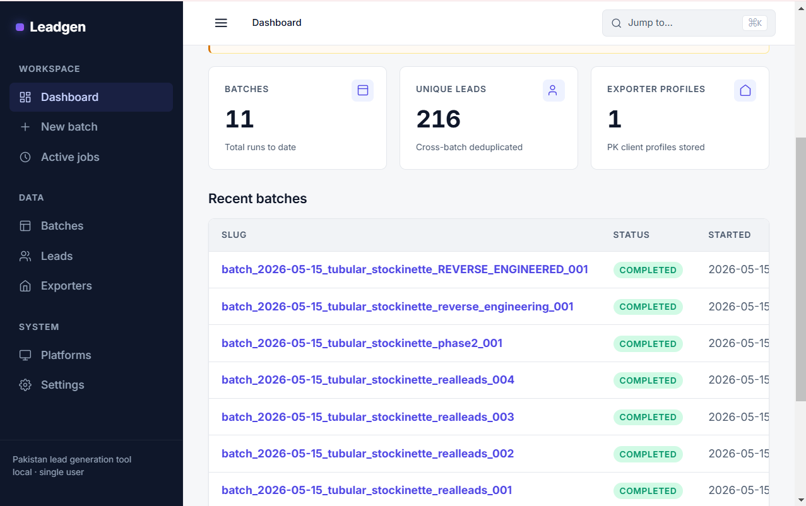
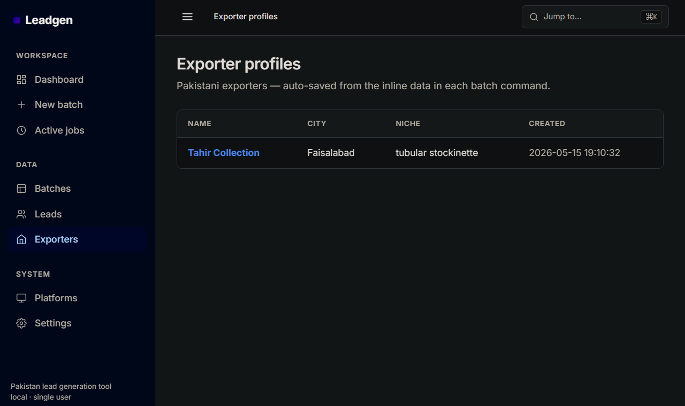
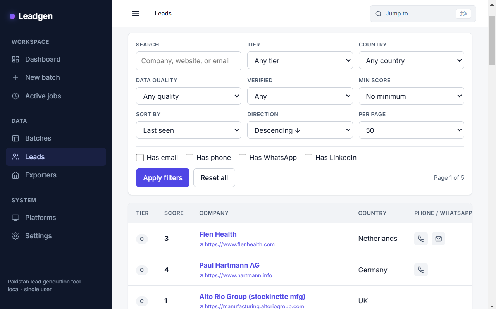
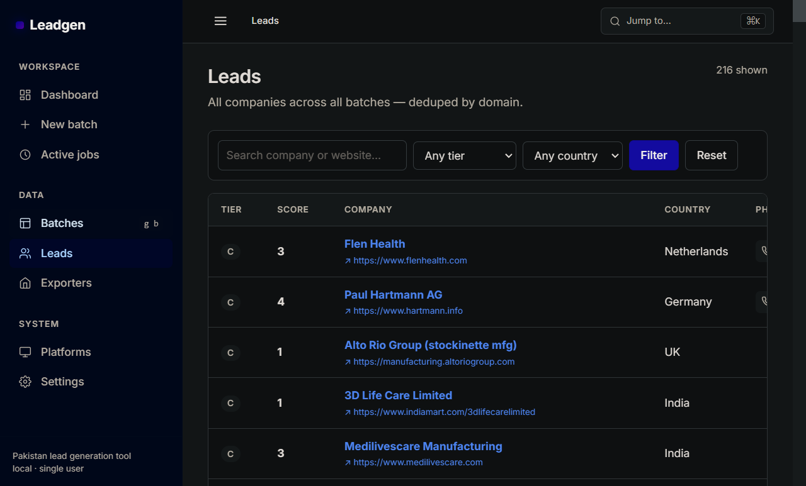
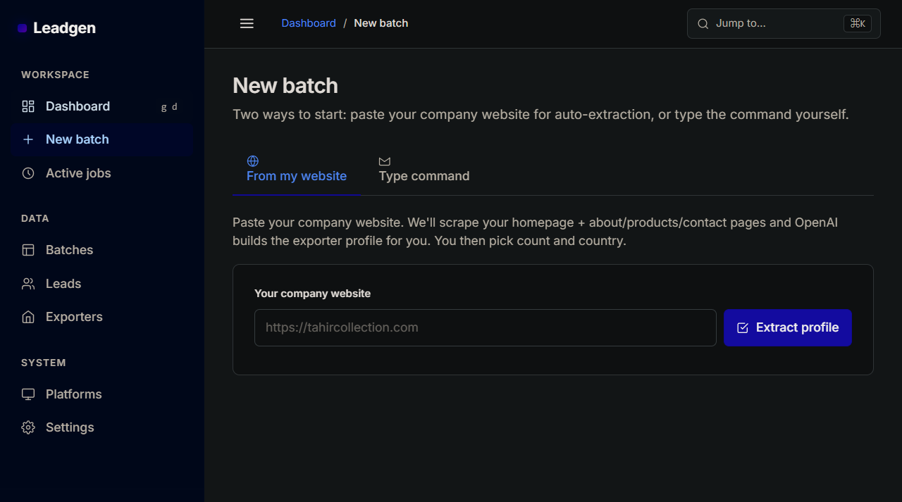
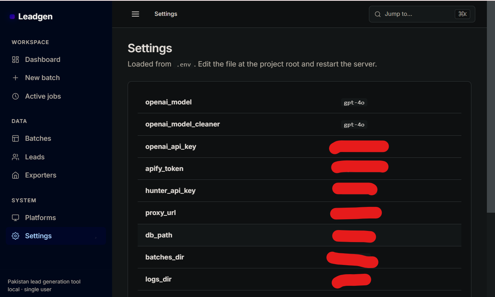

# Exporter Lead Generator - AI B2B Buyer Discovery

> Natural-language search over verified exporter and buyer data, turning a plain question into a qualified list.

Built by **[Muhammad Tanveer](https://www.linkedin.com/in/muhammad-tanveer-advenno/)** - Full-Stack AI Automation Engineer.

[](#source-code-and-access) [](https://github.com/haddindeve)

## Contents

- [The problem](#the-problem)
- [The approach](#the-approach)
- [Architecture](#architecture)
- [Tech stack](#tech-stack)
- [Key capabilities](#key-capabilities)
- [Selected code](#selected-code)
- [Screenshots](#screenshots)
- [Results](#results)
- [FAQ](#faq)
- [Source code and access](#source-code-and-access)
- [About the engineer](#about-the-engineer)
- [Related projects](#related-projects)

## The problem

Exporters looking for buyers work through directories and trade listings by hand. Finding companies that match a specific product, market and size means many searches and a lot of manual filtering, repeated for every new market.

## The approach

A natural-language query layer over collected and verified company data. The operator describes the buyer they want in plain language; the system translates that into structured filters, runs it against the dataset, and returns a qualified list with the contact detail needed to act on it.

## Architecture

| Component | Responsibility |
| --- | --- |
| **Query layer** | Natural-language to structured filter translation |
| **Data collection** | Sourcing and verification of company records |
| **Qualification** | Filtering and scoring against the described profile |
| **Export** | Result sets ready for outreach |

## Tech stack

| Layer | Technology |
| --- | --- |
| Language | Python |
| Query | LLM-driven natural-language interpretation |
| Data | Verified company and contact dataset |
| Testing | Automated test suite |

## Key capabilities

- Plain-language buyer search
- Verified contact data
- Profile-based qualification
- Exportable qualified lists
- Repeatable market research runs

## Selected code

From `leadgen/__main__.py` in the private repository:

```python
"""Entry point: ``python -m leadgen``.

Natural-language dispatch: if the first argv is not a known Click subcommand
and not a flag, we prepend ``run`` so the user can type a quoted natural-language
command without having to say the word "run".

  python -m leadgen "find 50 surgical importers in UAE"   -> run "find 50 ..."
  python -m leadgen run "find 50 ..."                     -> run "find 50 ..."
  python -m leadgen status <slug>                         -> status <slug>
  python -m leadgen --help                                -> help
"""

from __future__ import annotations

import sys

from .cli import main
```

## Screenshots















## Results

- Directory research reduced to a single described query
- Repeatable per-market runs instead of one-off manual searches

## FAQ

### What does natural-language search mean here?

You describe the buyer you want in a sentence; the system converts that into structured filters and runs it against the dataset.

### Where does the data come from?

Collected company records passed through a verification step before they reach the result set.

### Who is it for?

Exporters and trade businesses that need buyer discovery in specific markets.

### Is the implementation public?

No - private repository, access on request.

## Source code and access

This repository is the public case study for **Exporter Lead Generator - AI B2B Buyer Discovery**. The full implementation - application code, database schema, tests and deployment configuration - lives in a **private repository** on this account, alongside the rest of the work shown here.

Source access can be arranged for hiring conversations, technical review or client due diligence. The quickest route is a short message on [LinkedIn](https://www.linkedin.com/in/muhammad-tanveer-advenno/) or an email to [mtanveertahir66@gmail.com](mailto:mtanveertahir66@gmail.com).

## About the engineer

**Muhammad Tanveer - Full-Stack AI Automation Engineer**

Full-stack AI automation engineer. I build agentic systems, browser and workflow automation, RAG pipelines and the production web platforms they run on - from Rust and Python services to Next.js dashboards and PHP/MySQL business systems.

- GitHub: [haddindeve](https://github.com/haddindeve)
- LinkedIn: [Muhammad Tanveer](https://www.linkedin.com/in/muhammad-tanveer-advenno/)
- Email: [mtanveertahir66@gmail.com](mailto:mtanveertahir66@gmail.com)
- Location: Pakistan

## Related projects

- [LinkedIn Lead Finder and Analyser](https://github.com/haddindeve/linkedin-lead-finder-and-analyser)
- [AI Lab Support and Campus Routing Assistant](https://github.com/haddindeve/ai-lab-support-campus-routing)
- [Hafiz Fabrics - Retail POS and ERP](https://github.com/haddindeve/hafiz-fabrics-pos-erp)
- [SJ-AIOS - AI Operating System for Retail Operations](https://github.com/haddindeve/sj-aios-ai-operating-system)
- [ATM Electronic Journal Parser and GL Reconciliation](https://github.com/haddindeve/ej-rolls-atm-reconciliation)
- [AI Sales Agent - Automated Lead Generation and Outreach](https://github.com/haddindeve/advenno-ai-sales-agent)

---

<sub>Exporter Lead Generator - AI B2B Buyer Discovery - case study by Muhammad Tanveer - Full-Stack AI Automation Engineer. Keywords: B2B lead generation AI, exporter buyer discovery, natural language search leads, trade lead generation, supplier discovery tool, AI prospecting.</sub>